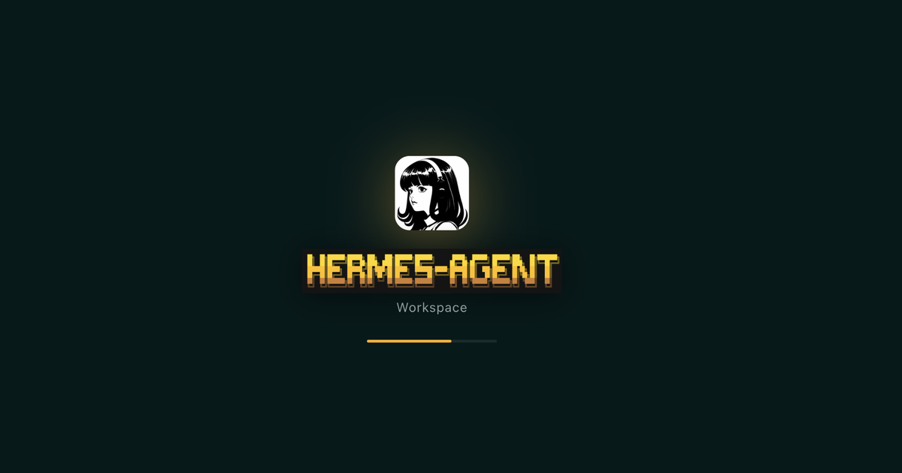
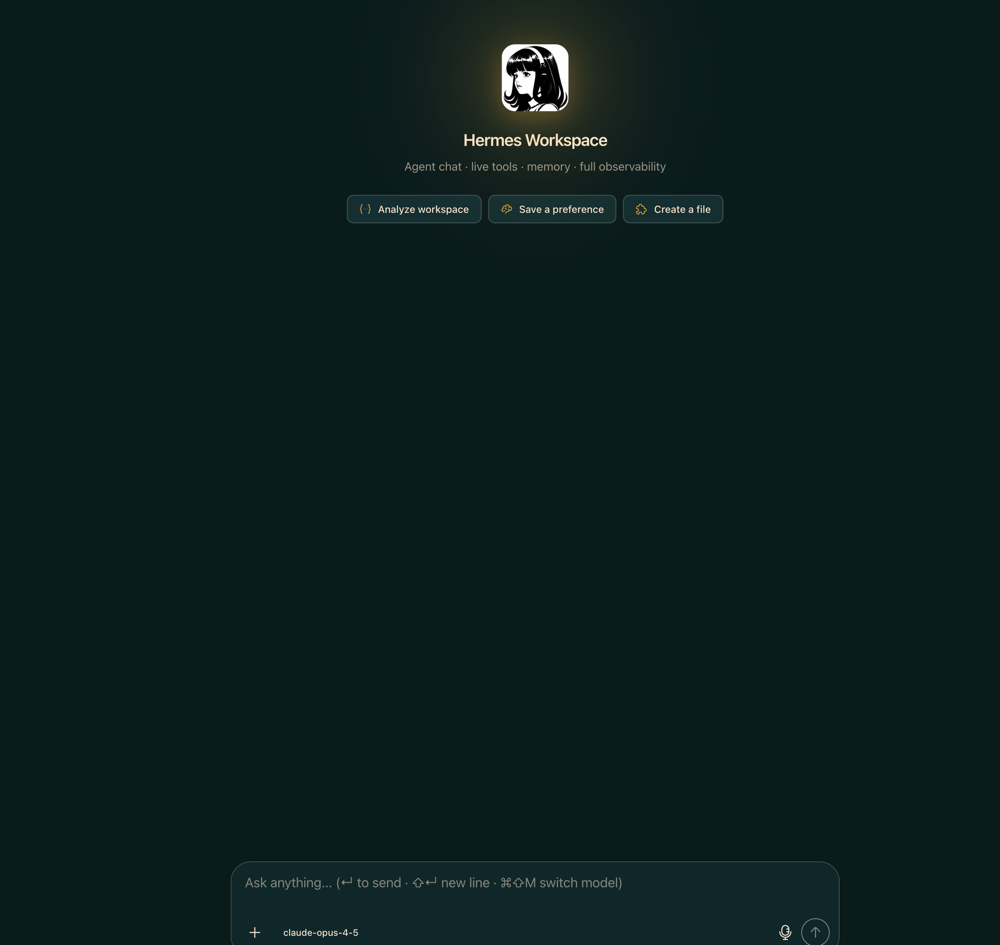
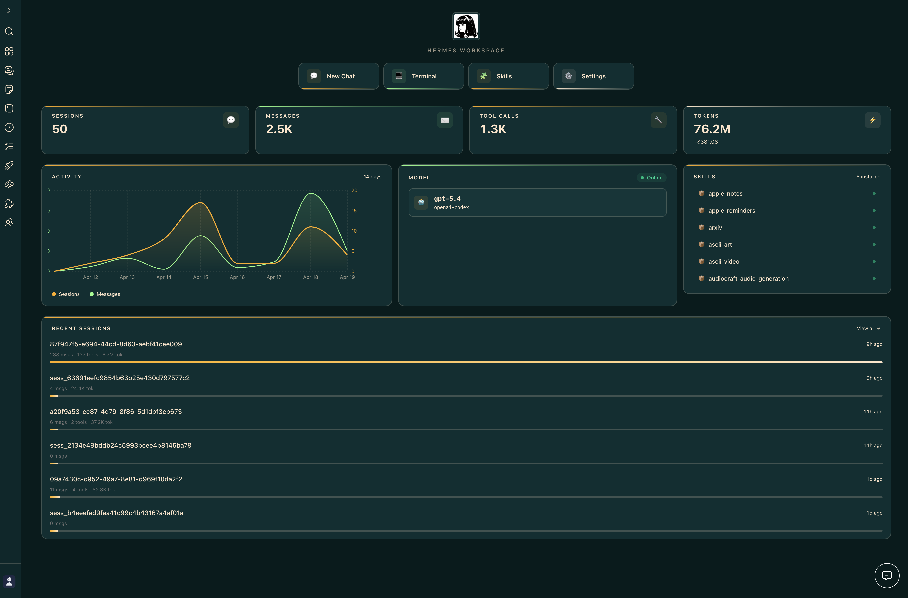
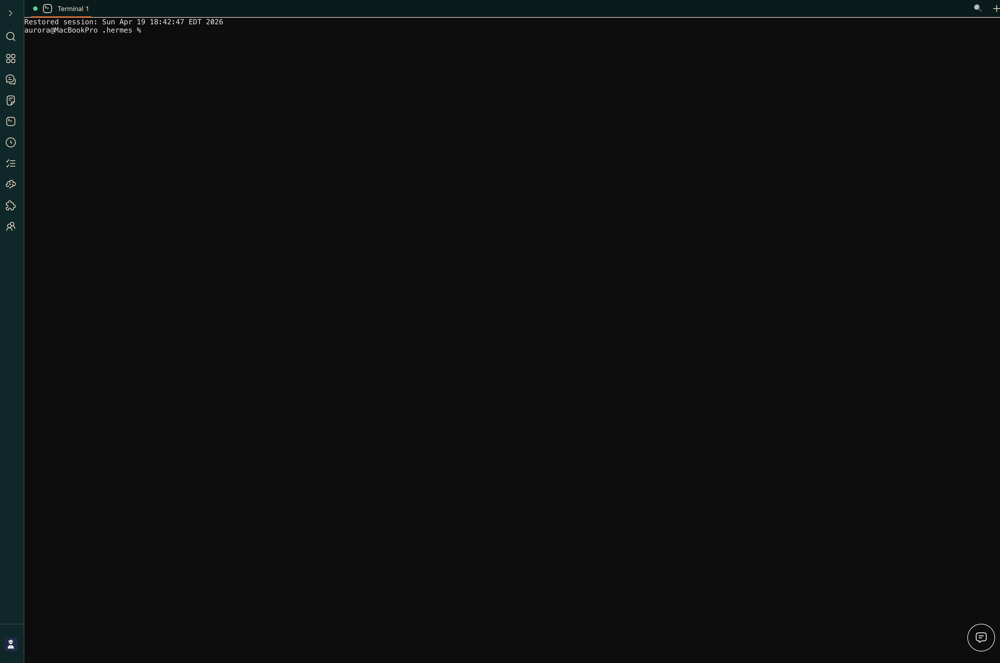

<div align="center">


<!-- avatar filename retained for cache stability — do not rename without coordinated cache-bust -->

# Hermes Workspace

**Your AI agent's command center — chat, files, memory, skills, and terminal in one place.**

[](CHANGELOG.md)
[](LICENSE)
[](https://nodejs.org/)
[](CONTRIBUTING.md)

> Not a chat wrapper. A complete workspace — orchestrate agents, browse memory, manage skills, and control everything from one interface.

> **v2 — zero-fork.** Clone, don't fork. Runs on vanilla [`NousResearch/hermes-agent`](https://github.com/NousResearch/hermes-agent) installed via Nous's own installer. Chat, sessions, memory, skills, jobs, MCP, terminal, dashboard, Agent View, and Operations are all in vanilla parity. **Conductor** uses the dashboard mission API when available and falls back to Workspace-native Swarm dispatch (`mode: native-swarm`) when the dashboard endpoint is absent, preserving zero-fork behavior ([#262](https://github.com/outsourc-e/hermes-workspace/issues/262)).



</div>

---

## Swarm Mode

Hermes Agent Swarm turns the workspace into a live control plane: unlimited Hermes Agents, 1 orchestrator, 0 humans manually dispatching.
Persistent tmux workers keep context across tasks, rotate safely, and report proof-bearing checkpoints.
Role-based dispatch routes builders, reviewers, docs, research, ops, triage, QA, and lab lanes without turning Eric into the task router.
A byte-verified review gate protects release branches before PRs ship.
Autonomous PR/issue lanes, lab experiments, and the repair playbook keep the machine moving while humans handle judgment.

Start here: [docs/swarm/](./docs/swarm/)

- **Orchestrator Chat** — ask the control plane for one task, a decomposed mission, or a full broadcast.
- **Multi-Agent Control Plane** — see persistent Hermes Agents, roles, state, runtime, and routing wires in one surface.
- **Kanban TaskBoard** — plan backlog, ready, running, review, blocked, and done lanes without leaving the workspace.
- **Reports + Inbox** — review checkpoints, blockers, handoffs, and ready-for-human decisions.
- **TUI View built in** — attach to tmux-backed workers or fall back to a live shell/log stream.

---

## ✨ What's inside

- 💬 **Chat** — Real-time SSE streaming, tool call rendering, multi-session, markdown + syntax highlighting
- 🧠 **Memory** — Browse, search, and edit agent memory; markdown live editor
- 🧩 **Skills** — Browse 2,000+ skills with origin badges, filters, source paths, marketplace
- 🔌 **MCP** — Full /mcp page (catalog + marketplace + sources), or fallback to local config CRUD
- 📁 **Files + Terminal** — Full workspace file browser with Monaco; cross-platform PTY terminal
- 🎮 **Operations** — Multi-agent dashboard with profile presets (Sage/Trader/Builder/Scribe/Ops) and 'Needs setup' detection
- 📡 **Conductor** — Mission dispatch + decomposition with dashboard-backed missions when available and Workspace-native Swarm fallback otherwise
- 👥 **Agent View** — Live agent panel in chat with avatar, queue, history, usage meter
- 🐝 **Swarm Mode** — Persistent tmux-backed Hermes Agent workers with role-based dispatch
- 🗄️ **Dashboard** — Aggregated overview: sessions, model mix, cost ledger, attention card, ops strip
- 🎨 **Themes** — Hermes, Nous, Bronze, Slate, Mono (light + dark)
- 🔒 **Security** — Auth middleware on every route, CSP, path-traversal guard, fail-closed remote bind
- 📱 **PWA + Tailscale** — Install as a native-feeling app; access from any device on your tailnet
- ⚙️ **Capability gates** — Features that need upstream endpoints (Conductor) show a clean placeholder instead of failing mid-action

---

## 📸 Screenshots

|                 Chat                 |                  Conductor                   |
| :----------------------------------: | :------------------------------------------: |
|  |  |

|                   Dashboard                  |                  Memory                  |
| :------------------------------------------: | :--------------------------------------: |
|  |  |

|                   Terminal                   |                   Settings                   |
| :------------------------------------------: | :------------------------------------------: |
|  |  |

|                  Tasks                  |                 Jobs                 |
| :--------------------------------------: | :----------------------------------: |
|  |  |

---

## 🚀 Quick Start

Three paths — pick the one that matches you:

| Path | Best for | Time |
|---|---|---|
| **🐳 [Docker Compose](#-docker-quickstart)** | Self-hosters, home labs, "give me a compose gig" | ~2 min |
| **🌐 One-line install** | Local dev on macOS/Linux | ~3 min |
| **🔌 Attach to existing `hermes-agent`** | You already run Hermes Agent | ~1 min |

### One-line install

```bash
curl -fsSL https://raw.githubusercontent.com/outsourc-e/hermes-workspace/main/install.sh | bash
```

This installs `hermes-agent` via Nous's official installer, clones this repo, sets up `.env`, and installs dependencies. Then:

```bash
hermes gateway run                  # terminal 1
cd ~/hermes-workspace && pnpm dev   # terminal 2
```

Open http://localhost:3000. That's it.

---

### Already running `hermes-agent`? Attach the workspace to it

If you already have `hermes-agent` installed (via Nous's official installer, a source checkout, systemd, Docker, or another existing setup) and it's serving the gateway at `http://<host>:8642`, you don't need to reinstall anything — just point the workspace at it.

```bash
git clone https://github.com/outsourc-e/hermes-workspace.git
cd hermes-workspace
pnpm install
cp .env.example .env

# Point at your existing Hermes Agent services.
echo 'HERMES_API_URL=http://127.0.0.1:8642' >> .env
# Zero-fork installs also need the separate dashboard API for config/sessions/skills/jobs.
echo 'HERMES_DASHBOARD_URL=http://127.0.0.1:9119' >> .env

# If your gateway was started with API_SERVER_KEY (auth enabled), set the same value:
# echo 'HERMES_API_TOKEN=***' >> .env

pnpm dev                            # http://localhost:3000 (override with PORT=4000 pnpm dev)
```

Requirements on the agent side:

- Gateway bound to an address the workspace can reach (typically `API_SERVER_HOST=0.0.0.0` + the port exposed).
- `API_SERVER_ENABLED=true` in `~/.hermes/.env` (or the agent's env) so the gateway serves core APIs on `:8642`.
- `hermes dashboard` running (default `http://127.0.0.1:9119`) for zero-fork installs. The dashboard provides config, sessions, skills, and jobs APIs.
- If `API_SERVER_KEY` is set, the workspace must pass the same value via `HERMES_API_TOKEN` — otherwise leave both unset.

Verify both services before opening the workspace:

- `curl http://127.0.0.1:8642/health` should return ok.
- `curl http://127.0.0.1:9119/api/status` should return dashboard metadata.
- `curl http://127.0.0.1:3000/api/sessions` (after the workspace boots) should return a sessions payload or an empty list.

If `/api/sessions` is already returning data, **do not start another gateway just because the UI still says Offline** — refresh or reprobe the Workspace UI first.

If your default model is `gpt-5.4` / `openai-codex`, make sure Codex CLI auth is live before testing chat:

```bash
codex login
```

Then start the workspace and complete onboarding — it should detect the gateway + dashboard pair and unlock the enhanced panes automatically.

#### Running on a remote host (Tailscale / VPN / LAN)

If the workspace and its browser live on different machines — e.g. the workspace runs on a Pi/Mac/home server and you access it from your phone over Tailscale — point `HERMES_API_URL` at the **reachable** backend address, not `127.0.0.1`:

```bash
# On the server running the workspace + gateway:
echo 'HERMES_API_URL=http://100.x.y.z:8642' >> .env
echo 'HERMES_DASHBOARD_URL=http://100.x.y.z:9119' >> .env

# Also tell the gateway to listen on all interfaces so Tailscale peers can reach it.
# In ~/.hermes/.env (or wherever the gateway reads config):
echo 'API_SERVER_HOST=0.0.0.0' >> ~/.hermes/.env
```

Then restart the gateway, dashboard, and workspace. Hit the workspace from the remote device and the connection probe will use the Tailscale IP instead of localhost. Both `HERMES_API_URL` and `HERMES_DASHBOARD_URL` must be set to Tailscale/LAN-reachable URLs — setting only one will leave the other probing `127.0.0.1` and failing.

**If you've already started the workspace**, you can update both URLs from `Settings → Connection` without restarting. The values are persisted to `~/.hermes/workspace-overrides.json` and take effect immediately (gateway capabilities are reprobed on save). Editing `.env` still works for pre-start config and for CI/containers.

---

### Manual install

Hermes Workspace works with any OpenAI-compatible backend. If your backend also exposes Hermes Agent gateway APIs, enhanced features like sessions, memory, skills, and jobs unlock automatically.

#### Prerequisites

- **Node.js 22+** — [nodejs.org](https://nodejs.org/)
- **An OpenAI-compatible backend** — local, self-hosted, or remote
- **Optional:** Python 3.11+ if you want to run a Hermes Agent gateway locally

#### Step 1: Start your backend

Point Hermes Workspace at any backend that supports:

- `POST /v1/chat/completions`
- `GET /v1/models` recommended

Example Hermes Agent gateway setup (from scratch):

```bash
# Install hermes-agent via Nous's official installer
curl -fsSL https://raw.githubusercontent.com/NousResearch/hermes-agent/main/scripts/install.sh | bash

# Configure a provider + start the gateway
hermes setup
hermes gateway run
```

Our one-liner installer (below) does both steps automatically. If you're using another OpenAI-compatible server, just note its base URL.

### Step 2: Install & Run Hermes Workspace

```bash
# In a new terminal
git clone https://github.com/outsourc-e/hermes-workspace.git
cd hermes-workspace
pnpm install
cp .env.example .env
printf '\nHERMES_API_URL=http://127.0.0.1:8642\n' >> .env
pnpm dev                   # Starts on http://localhost:3000
```

> **Verify:** Open `http://localhost:3000` and complete the onboarding flow. First connect the backend, then verify chat works. If your gateway exposes Hermes Agent APIs, advanced features appear automatically.

#### Run without an open terminal

After `pnpm build`, install Workspace as a user-level launchd/systemd service:

```bash
chmod +x scripts/install-dashboard-service.sh
scripts/install-dashboard-service.sh
```

See [`docs/dashboard-service.md`](docs/dashboard-service.md) for macOS launchd, Linux systemd, logs, overrides, and uninstall steps.

#### Environment Variables

```env
# OpenAI-compatible backend URL
HERMES_API_URL=http://127.0.0.1:8642

# Optional: provider keys the Hermes Agent gateway can read at runtime.
# You only need the key(s) for whichever provider(s) you actually use.
# OPENAI_API_KEY=sk-...                # GPT / o-series / OpenAI-compatible
# OPENROUTER_API_KEY=sk-or-v1-...      # OpenRouter (incl. free models)
# GOOGLE_API_KEY=AIza...               # Gemini
# MODEL_API_TOKEN=...                  # Claude-GPT proxy models (claude-opus-4.7 / 4.y)
# (Ollama / LM Studio / local servers don't need a key)

# Optional: password-protect the web UI
# HERMES_PASSWORD=your_password
```

---

## 🧠 Local Models (Ollama, Atomic Chat, LM Studio, vLLM)

Hermes Workspace supports two modes with local models:

### Portable Mode (Easiest)

Point the workspace directly at your local server — no Hermes Agent gateway needed.

### Atomic Chat

```bash
# Start workspace pointed at Atomic Chat
HERMES_API_URL=http://127.0.0.1:1337/v1 pnpm dev
```

Download [Atomic Chat](https://atomic.chat/), launch the desktop app, and make sure a model is loaded before starting Hermes Workspace.

### Ollama

```bash
# Start Ollama
OLLAMA_ORIGINS=* ollama serve

# Start workspace pointed at Ollama
HERMES_API_URL=http://127.0.0.1:11434 pnpm dev
```

Chat works immediately. Sessions, memory, and skills show "Not Available" — that's expected in portable mode.

### Enhanced Mode (Full Features)

Route through the Hermes Agent gateway for sessions, memory, skills, jobs, and tools.

Here are two explicit `~/.hermes/config.yaml` examples for the local providers we support directly in the workspace:

**Atomic Chat**

```yaml
provider: atomic-chat
model: your-model-name
custom_providers:
  - name: atomic-chat
    base_url: http://127.0.0.1:1337/v1
    api_key: atomic-chat
    api_mode: chat_completions
```

**Ollama**

```yaml
provider: ollama
model: qwen3:32b
custom_providers:
  - name: ollama
    base_url: http://127.0.0.1:11434/v1
    api_key: ollama
    api_mode: chat_completions
```

You can adapt the same shape for other OpenAI-compatible local runners, but `Atomic Chat` and `Ollama` are the two built-in local paths documented in the workspace UI.

**2. Enable the API server in `~/.hermes/.env`:**

```env
API_SERVER_ENABLED=true
```

**3. Start the gateway, dashboard, and workspace:**

```bash
hermes gateway run          # Starts core APIs on :8642
hermes dashboard            # Starts dashboard APIs on :9119
HERMES_API_URL=http://127.0.0.1:8642 \
HERMES_DASHBOARD_URL=http://127.0.0.1:9119 \
pnpm dev
```

For authenticated gateways, also set `HERMES_API_TOKEN` in the workspace environment to the same value as `API_SERVER_KEY`.

All workspace features unlock automatically once both services are reachable — sessions persist, memory saves across chats, skills are available, and the dashboard shows real usage data.

> **Works with any OpenAI-compatible server** — Atomic Chat, Ollama, LM Studio, vLLM, llama.cpp, LocalAI, etc. Just change the `base_url` and `model` in the config above.

---

## 🤝 Pair an Agent with the Workspace

Workspace is the UI. **Hermes Agent** is the brain. They talk over two HTTP services on localhost (or any reachable network).

```
┌───────────────┐         :8642 gateway          ┌────────────────┐
│   Workspace    │ ─────────────────────▶ │  Hermes Agent  │
│   :3000 (UI)   │ ◀───────────────────── │  CLI / brain   │
└───────────────┘         :9119 dashboard        └────────────────┘
```

### Two services, three commands

```bash
hermes gateway run     # terminal 1 · :8642 · chat, models, streaming, jobs
hermes dashboard       # terminal 2 · :9119 · sessions, skills, config, MCP
cd ~/hermes-workspace && pnpm dev   # terminal 3 · :3000 · the UI
```

> **Tip:** `pnpm start:all` starts gateway + dashboard + workspace in one shot if you've installed via the one-liner.

### Windows (PowerShell + WSL) one-command startup

If you use Hermes Workspace from Windows with the agent running in WSL, use the helper script in this repo:

```powershell
# from the repo root
.\scripts\start-hermes-workspace.ps1
```

To force a clean relaunch of the tmux session:

```powershell
.\scripts\start-hermes-workspace.ps1 -Restart
```

Optional parameters:
- `-Distro <name>` to target a non-default WSL distro
- `-WorkspacePath </path/in/wsl>` if your clone is not at `~/hermes-workspace`
- `-SessionName <name>` to use a custom tmux session name

### Verify the pairing

```bash
curl http://127.0.0.1:8642/health        # → {"status":"ok","platform":"hermes-agent"}
curl http://127.0.0.1:9119/api/status    # → {"status":"ok", ...}
```

Both must return `200`. If either fails, the workspace will fall back to **portable mode** (chat works, sessions/skills/memory show "Not Available").

### `.env` settings the workspace cares about

```env
# Required: where the gateway is
HERMES_API_URL=http://127.0.0.1:8642

# Recommended: where the dashboard is (unlocks sessions/skills/config/MCP/jobs)
HERMES_DASHBOARD_URL=http://127.0.0.1:9119

# Only if your gateway was started with API_SERVER_KEY=... — paste the same value:
# HERMES_API_TOKEN=***

# Optional: enables Claude-GPT provider models in the workspace model picker.
# MODEL_API_TOKEN=***

# Optional: password-protect the web UI itself
# HERMES_PASSWORD=***
```

### Common pairing scenarios

| Scenario | Set this |
|---|---|
| Workspace + gateway on the same machine | `HERMES_API_URL=http://127.0.0.1:8642`, `HERMES_DASHBOARD_URL=http://127.0.0.1:9119` |
| Gateway on a remote server (Tailscale / VPN) | Set both URLs to the reachable IP (e.g. `http://100.x.y.z:8642`) and add `API_SERVER_HOST=0.0.0.0` to the gateway's `~/.hermes/.env` |
| Already-running `hermes-agent` from upstream installer | Just set `HERMES_API_URL` + `HERMES_DASHBOARD_URL` and skip the one-liner installer |
| Multiple agent profiles | Profiles live under `~/.hermes/profiles/<name>` — the dashboard switches between them at runtime; workspace follows automatically |

### Live re-pairing (no restart)

If you've already started the workspace, change either URL from **Settings → Connection** without restarting. Values persist to `~/.hermes/workspace-overrides.json` and gateway capabilities are reprobed on save.

### Troubleshooting

- **`Could not reach Hermes gateway on 8645, 8642, or 8643`** — gateway isn't running, or `HERMES_API_URL` points somewhere unreachable. Run `hermes gateway run` and re-check.
- **Workspace shows "portable mode" / extended APIs missing** — dashboard isn't running. Start `hermes dashboard` in another terminal and refresh.
- **Sessions probe says unavailable / UI claims Offline but pairing should be live** — verify `curl http://localhost:3000/api/sessions` before starting another gateway. If it returns sessions (or an empty array), the backend pairing is alive and the UI needs a refresh/reprobe.
- **Chat send fails on `gpt-5.4` / Codex** — Codex CLI auth is stale. Run `codex login`, then retry the chat without starting another gateway.
- **`Unauthorized` on every API call** — gateway has `API_SERVER_KEY` set but workspace is missing `HERMES_API_TOKEN`. Match them.
- **`Could not connect` from your phone over Tailscale** — gateway is bound to loopback. Set `API_SERVER_HOST=0.0.0.0` in `~/.hermes/.env` and restart it.

---

## 🐳 Docker Quickstart

[](https://github.com/codespaces/new?hide_repo_select=true&ref=main&repo=outsourc-e/hermes-workspace)

The Docker setup runs both the **Hermes Agent gateway** and **Hermes Workspace** together.

### Prerequisites

- **Docker**
- **Docker Compose**
- **A configured Hermes Agent model provider** — run `hermes setup` / `hermes model`, or provide a key for whichever provider you use. This workspace does not require Anthropic.

### Step 1: Configure Environment

```bash
git clone https://github.com/outsourc-e/hermes-workspace.git
cd hermes-workspace
cp .env.example .env
```

Edit `.env` and add **at least one** LLM provider key — whichever provider you want hermes-agent to use:

```env
# Pick one (or more). You do NOT need all of these.
# OPENAI_API_KEY=sk-...                # GPT / o-series / OpenAI-compatible
# OPENROUTER_API_KEY=sk-or-v1-...      # OpenRouter (free models available)
# GOOGLE_API_KEY=AIza...               # Gemini
# MODEL_API_TOKEN=...                  # Claude-GPT proxy models
```

Using **Ollama, LM Studio, or another local server**? No key needed — just point hermes-agent at your local endpoint via the onboarding flow.

> **Heads up:** `hermes-agent` needs to be able to reach _some_ model. If you don't configure any provider (API key or local server), chat will fail on first message.

### Step 2: Start the Services

```bash
docker compose up
```

This pulls two pre-built images and starts them:

- **hermes-agent** → `nousresearch/hermes-agent:latest` on port **8642**
- **hermes-workspace** → `ghcr.io/outsourc-e/hermes-workspace:latest` on port **3000**

No local build. First run takes a minute to pull; subsequent starts are instant.
Agent state (config, sessions, skills, memory, credentials) persists in the
legacy-named `claude-data` Docker volume, so containers can be recreated without data loss.

### Step 3: Access the Workspace

Open `http://localhost:3000` and complete the onboarding.

> **Verify:** Check the Docker logs for `[gateway] Connected to Hermes Agent` — this confirms the workspace successfully connected to the agent.

### Remote Access (LAN / Tailscale / VPN)

The default compose file binds ports to `127.0.0.1` (localhost only). To access the workspace from other devices on your network, you need to:

**1. Publish ports without the loopback restriction.** Create a `docker-compose.override.yml`:

```yaml
services:
  hermes-agent:
    ports:
      - '8642:8642'
  hermes-workspace:
    ports:
      - '3000:3000'
```

**2. Add these env vars to `.env`:**

```env
# Required: workspace session password (the workspace refuses to start on 0.0.0.0 without it)
HERMES_PASSWORD=your-strong-secret-here

# Required for plain-HTTP LAN access (browsers drop Secure cookies over http://)
COOKIE_SECURE=0

# Recommended: gateway auth token (prevents unauthenticated API access on your LAN)
API_SERVER_KEY=***

# If the gateway refuses to start with "No user allowlists configured":
GATEWAY_ALLOW_ALL_USERS=true
```

**3. Restart the stack:**

```bash
docker compose down && docker compose up -d
```

> **HTTPS behind a reverse proxy?** If you terminate TLS at a reverse proxy (Traefik, Nginx, Caddy, Tailscale Funnel), set `COOKIE_SECURE=1` instead and add `TRUST_PROXY=1` so IP classification works correctly.

### Troubleshooting Docker

| Symptom | Fix |
|---|---|
| `[workspace] refusing to start — HERMES_PASSWORD is unset` | Add `HERMES_PASSWORD=<secret>` to `.env` |
| Login silently fails (no error, page reloads) | Add `COOKIE_SECURE=0` for HTTP, or `COOKIE_SECURE=1` + HTTPS |
| `[Api_Server] Refusing to start: binding to 0.0.0.0 requires API_SERVER_KEY` | Add `API_SERVER_KEY=*** to `.env` |
| `No user allowlists configured. All unauthorized users will be denied.` | Add `GATEWAY_ALLOW_ALL_USERS=true` to `.env` |
| `CLAUDE_DASHBOARD_TOKEN is not set` warning | Set `CLAUDE_DASHBOARD_TOKEN` to the same value as `API_SERVER_KEY` |
| 500 Internal Server Error on login after setting all the above | Clear browser cookies for the workspace domain, then retry |

### Building from source

Want to hack on the workspace and have local changes hot-built into the
container? Use the dev overlay:

```bash
docker compose -f docker-compose.yml -f docker-compose.dev.yml up --build
```

The base `docker-compose.yml` stays untouched — the overlay adds a `build:`
block for the `hermes-workspace` service so the local repo is compiled
instead of pulled. The Hermes Agent service still uses the canonical
`nousresearch/hermes-agent:latest` image; if you need a custom agent
build, tag it locally and override `image:` in your own
`compose.override.yml`.

### Using a Pre-Built Image (Coolify / Easypanel / Dokploy / Unraid)

Deploying Hermes Workspace to a PaaS or home-lab stack? Pull the image
directly from GitHub Container Registry:

```
ghcr.io/outsourc-e/hermes-workspace:latest
```

Available tags:

| Tag | What it is |
|---|---|
| `latest` | Latest `main` commit (stable; recommended) |
| `v2.0.0` | Pinned semver tag |
| `main-<sha>` | Specific commit |

Minimal Coolify / Easypanel config:

```yaml
service: hermes-workspace
image: ghcr.io/outsourc-e/hermes-workspace:latest
port: 3000
env:
  HERMES_API_URL: http://hermes-agent:8642   # point at your gateway
  HERMES_API_TOKEN: ${API_SERVER_KEY}        # if gateway auth is enabled
```

The image is built for `linux/amd64` and `linux/arm64`. Pair it with either
a `nousresearch/hermes-agent:latest` container (what our `docker-compose.yml`
does by default) or an existing gateway on another host.

---

## 📱 Install as App (Recommended)

Hermes Workspace is a **Progressive Web App (PWA)** — install it for the full native app experience with no browser chrome, keyboard shortcuts, and offline support.

### 🖥️ Desktop (macOS / Windows / Linux)

1. Open Hermes Workspace in **Chrome** or **Edge** at `http://localhost:3000`
2. Click the **install icon** (⊕) in the address bar
3. Click **Install** — Hermes Workspace opens as a standalone desktop app
4. Pin to Dock / Taskbar for quick access

> **macOS users:** After installing, you can also add it to your Launchpad.

### 📱 iPhone / iPad (iOS Safari)

1. Open Hermes Workspace in **Safari** on your iPhone
2. Tap the **Share** button (□↑)
3. Scroll down and tap **"Add to Home Screen"**
4. Tap **Add** — the Hermes Workspace icon appears on your home screen
5. Launch from home screen for the full native app experience

### 🤖 Android

1. Open Hermes Workspace in **Chrome** on your Android device
2. Tap the **three-dot menu** (⋮) → **"Add to Home screen"**
3. Tap **Add** — Hermes Workspace is now a native-feeling app on your device

---

## 📡 Mobile Access via Tailscale

Access Hermes Workspace from anywhere on your devices — no port forwarding, no VPN complexity.

### Setup

1. **Install Tailscale** on your Mac and mobile device:
   - Mac: [tailscale.com/download](https://tailscale.com/download)
   - iPhone/Android: Search "Tailscale" in the App Store / Play Store

2. **Sign in** to the same Tailscale account on both devices

3. **Find your Mac's Tailscale IP:**

   ```bash
   tailscale ip -4
   # Example output: 100.x.x.x
   ```

4. **Open Hermes Workspace on your phone:**

   ```
   http://100.x.x.x:3000
   ```

5. **Add to Home Screen** using the steps above for the full app experience

> 💡 Tailscale works over any network — home wifi, mobile data, even across countries. Your traffic stays end-to-end encrypted.

---

## 🖥️ Native Desktop App

> **Status: In Development** — A native Electron-based desktop app is in active development.

The desktop app will offer:

- Native window management and tray icon
- System notifications for agent events and mission completions
- Auto-launch on startup
- Deep OS integration (macOS menu bar, Windows taskbar)

**In the meantime:** Install Hermes Workspace as a PWA (see above) for a near-native desktop experience — it works great.

---

## ☁️ Cloud & Hosted Setup

> **Status: Coming Soon**

A fully managed cloud version of Hermes Workspace is in development:

- **One-click deploy** — No self-hosting required
- **Multi-device sync** — Access your agents from any device
- **Team collaboration** — Shared mission control for your whole team
- **Automatic updates** — Always on the latest version

Features pending cloud infrastructure:

- Cross-device session sync
- Team shared memory and workspaces
- Cloud-hosted backend with managed uptime
- Webhook integrations and external triggers

---

## 🔒 Security & deployment env vars

Key safeguards — most are on by default, the env vars below are for remote / Docker deployments where you opt out of the loopback default.

### Built-in safeguards

- Auth middleware on every API route
- CSP headers via meta tags
- Path-traversal prevention on file/memory routes (real-path boundary check, not string prefix)
- Rate limiting on endpoints
- Fail-closed startup guard: refuses to bind non-loopback without `HERMES_PASSWORD`
- Session cookies: `HttpOnly` + `SameSite=Strict` + `Secure` (in production)
- Optional password protection for the web UI

### Env vars for remote / Docker deployments

- `HERMES_PASSWORD` — required whenever `HOST ≠ 127.0.0.1` (legacy `CLAUDE_PASSWORD` still honored as a fallback)
- `COOKIE_SECURE=1` — force the `Secure` cookie flag when terminating HTTPS at a proxy
- `COOKIE_SECURE=0` — disable the `Secure` flag for plain-HTTP LAN deployments (`HOST=0.0.0.0` without HTTPS); without this, browsers silently drop session cookies and login fails (#149)
- `TRUST_PROXY=1` — trust `x-forwarded-for` / `x-real-ip` (only set behind a sanitizing reverse proxy)
- `HERMES_DASHBOARD_TOKEN` — explicit bearer for dashboard API (preferred over the legacy HTML-scrape fallback)
- `HERMES_API_TOKEN` — bearer for the Hermes Agent gateway when started with `API_SERVER_KEY` (legacy `CLAUDE_API_TOKEN` still honored)
- `HERMES_ALLOW_INSECURE_REMOTE=1` — bypass the fail-closed guard (not recommended)

See `.env.example` for the full list. Credits to [@kiosvantra](https://github.com/kiosvantra) for the security audit surfacing #121–#125.

---

## 🔧 Troubleshooting

### "Workspace loads but chat doesn't work"

The workspace auto-detects your gateway's capabilities on startup. Check your terminal for a line like:

```
[gateway] http://127.0.0.1:8642 available: health, models; missing: sessions, skills, memory, config, jobs
[gateway] Missing Hermes Agent APIs detected. Update hermes-agent to the latest version.
```

**Fix:** Upgrade to the latest stock `hermes-agent`, which ships the extended endpoints:

```bash
cd ~/hermes-agent && git pull && uv pip install -e .
hermes gateway run
```

(If you installed via a different path, follow your Nous installer's upgrade instructions.) If you were on the old `outsourc-e/hermes-agent` fork, it's no longer needed as of v2 — uninstall it and use upstream instead.

### "Connection refused" or workspace hangs on load

Your Hermes Agent gateway isn't running. Start it:

```bash
hermes gateway run
```

First-time run? Do `hermes setup` first to pick a provider and model.

### Ollama: chat returns empty or model shows "Offline"

Make sure your `~/.hermes/config.yaml` has the `custom_providers` section and `API_SERVER_ENABLED=true` in `~/.hermes/.env`. See [Local Models](#-local-models-ollama-lm-studio-vllm) above.

Also ensure Ollama is running with CORS enabled:

```bash
OLLAMA_ORIGINS=* ollama serve
```

Use `http://127.0.0.1:11434/v1` (not `localhost`) as the base URL.

Verify: `curl http://localhost:8642/health` should return `{"status": "ok"}`.

### "Using upstream NousResearch/hermes-agent"

v2+ runs on vanilla `hermes-agent`. **No fork required.** The upstream ships every endpoint the workspace needs for chat, sessions, memory, skills, config, jobs, MCP, terminal, and Agent View.

**Conductor note:** when the dashboard mission API is available, Workspace uses it directly. When that endpoint is absent, Workspace uses its native Swarm fallback and returns `mode: native-swarm`. The fallback dispatches through Workspace Swarm workers, keeps status available through `/api/conductor-spawn?missionId=...`, and cancels through `/api/conductor-stop`.

If you're pinned to an older `hermes-agent` version and missing core endpoints, the workspace will degrade gracefully to **portable mode** with basic chat — upgrade upstream to restore full features.

### Docker: "Unauthorized" or "Connection refused" to hermes-agent

If using Docker Compose and getting auth errors:

1. **Check at least one provider key is set:**

   ```bash
   grep -E '_API_KEY' .env
   # Should show one of: OPENAI_API_KEY, OPENROUTER_API_KEY, GOOGLE_API_KEY, or another provider key you intentionally use.
   ```

   (hermes-agent reads whichever key matches the provider configured in `~/.hermes/config.yaml`.)

2. **View the agent container logs:**

   ```bash
   docker compose logs hermes-agent
   ```

   Look for startup errors or missing API key warnings.

3. **Verify the agent health endpoint:**

   ```bash
   curl http://localhost:8642/health
   # Should return: {"status": "ok"}
   ```

4. **Restart with fresh containers:**

   ```bash
   docker compose down
   docker compose up --build
   ```

5. **Check workspace logs for gateway status:**
   ```bash
   docker compose logs hermes-workspace
   ```
   Look for: `[gateway] http://hermes-agent:8642 mode=...` — if it shows `mode=disconnected`, the agent isn't running correctly.

### Docker: older `claude webapi` docs are wrong

The `claude webapi` command referenced in some pre-rename docs doesn't exist. The correct commands are:

```bash
hermes gateway run    # FastAPI gateway on :8642
hermes dashboard      # dashboard plugin on :9119 (sessions/skills/jobs/config)
```

The Docker setup runs both automatically — no action needed if using `docker compose up`.

---

## 🗺️ Roadmap

### Shipped ✅

| Feature | What it does |
|---|---|
| Chat + SSE streaming | Live agent output with tool call rendering |
| Files + Terminal | Full workspace file browser + cross-platform PTY |
| Memory + Skills browsers | Edit memory, browse 2,000+ skills with marketplace |
| Dashboard | Sessions, model mix, cost ledger, attention card |
| Operations | Multi-agent management with preset personas |
| Agent View | Live agent panel in chat |
| Swarm Mode | Persistent tmux-backed worker pool with role dispatch |
| MCP page | Full catalog + marketplace + sources |
| Mobile PWA + Tailscale | Install as native-feeling app on any device |
| Themes | Hermes / Nous / Bronze / Slate / Mono (light + dark) |
| Capability gates | Graceful 'upstream not ready' placeholders |
| Multi-provider | OpenAI/OpenAI-compatible, OpenRouter, Google, Ollama, LM Studio, vLLM, Atomic Chat, and other Hermes-supported providers |

### In progress 🔨

| Feature | Status |
|---|---|
| Conductor missions | Workspace UI is shipped; uses dashboard mission API when available and Workspace-native Swarm fallback otherwise (see [#262](https://github.com/outsourc-e/hermes-workspace/issues/262)) |
| Native Desktop App (Electron) | Spec'd; PWA install path works today |

### Coming 🔜

| Feature | Status |
|---|---|
| Cloud / Hosted version | Pending infra |
| Team collaboration | Pending cloud + multi-tenant work |

---

## ⭐ Star History

## [](https://www.star-history.com/#outsourc-e/hermes-workspace&type=date&logscale&legend=top-left)

## 💛 Support the Project

Hermes Workspace is free and open source. If it's saving you time and powering your workflow, consider supporting development:

**ETH:** `0xB332D4C60f6FBd94913e3Fd40d77e3FE901FAe22`

[](https://github.com/sponsors/outsourc-e)

Every contribution helps keep this project moving. Thank you 🙏

---

## 🤝 Contributing

PRs are welcome! See [CONTRIBUTING.md](CONTRIBUTING.md) for guidelines.

- Bug fixes → open a PR directly
- New features → open an issue first to discuss
- Security issues → see [SECURITY.md](SECURITY.md) for responsible disclosure

---

## 📄 License

MIT — see [LICENSE](LICENSE) for details.

---

<div align="center">
  <sub>Built with ⚡ by <a href="https://github.com/outsourc-e">@outsourc-e</a> and the Hermes Workspace community</sub>
</div>
